# S3B Global Website Sitemap & Information Architecture

This document maps out the structural hierarchy, page routing, and directories of the S3B Global website.

---

## 1. Visual Sitemap Architecture

The diagram below outlines the logical navigation flow and directory hierarchy of the website:

```mermaid
graph TD
    %% Base Site Hierarchy
    Home["Home Page (/)"]
    
    %% Main Sections
    Services["Services (/services/[slug])"]
    Blog["Blog Hub (/blog/)"]
    About["About Us (/about-us/)"]
    Careers["Careers (/careers/)"]
    Contact["Contact (/contact-us/)"]
    
    Home --> Services
    Home --> Blog
    Home --> About
    Home --> Careers
    Home --> Contact
    
    %% Services Subpages
    AITrans["AI Transformation"]
    CloudInfra["Cloud + Infrastructure"]
    DataAI["Data + AI"]
    DigitalProd["Digital Product Experience"]
    EnterpriseServ["Enterprise IT Solutions"]
    
    Services --> AITrans
    Services --> CloudInfra
    Services --> DataAI
    Services --> DigitalProd
    Services --> EnterpriseServ
    
    %% Blog Subpages
    Post1["why-s3bglobal-is-the-best-website-development-team-in-the-uae"]
    Post2["best-digital-marketing-services-in-atlanta-s3b-global"]
    Post3["s3bglobal-next-generation-ai-technology-partner-for-modern-businesses"]
    PostMore["+ 38 Other Industry Insights"]
    
    Blog --> Post1
    Blog --> Post2
    Blog --> Post3
    Blog --> PostMore
    
    %% Formatting Styles
    style Home fill:#1A365D,stroke:#3182CE,stroke-width:3px,color:#FFF
    style Services fill:#2C3E50,stroke:#3498DB,stroke-width:2px,color:#FFF
    style Blog fill:#2C3E50,stroke:#3498DB,stroke-width:2px,color:#FFF
    style About fill:#2C3E50,stroke:#16A085,stroke-width:2px,color:#FFF
    style Careers fill:#2C3E50,stroke:#16A085,stroke-width:2px,color:#FFF
    style Contact fill:#2C3E50,stroke:#E74C3C,stroke-width:2px,color:#FFF
```

---

## 2. Directory & Route Mapping

The following table maps the public URL paths to their corresponding Next.js components, file system paths, and compilation types under the static export configuration:

| Route Path | Next.js File Path | Build Type | Description | Primary SEO Focus |
| :--- | :--- | :--- | :--- | :--- |
| `/` | `src/app/page.tsx` | Static | Company Landing & Hero Section | Brand, Core Competencies |
| `/about-us/` | `src/app/about-us/page.tsx` | Static | Corporate Profile & Milestones | Team Trust & Mission |
| `/services/[slug]/` | `src/app/services/[slug]/page.tsx` | SSG (Static) | Specialized Services Detail | Service keywords (SOC 2, AI) |
| `/blog/` | `src/app/blog/page.tsx` | Static | Blog Landing & Category Feed | Thought Leadership Hub |
| `/blog/[slug]/` | `src/app/blog/[slug]/page.tsx` | SSG (Static) | Tech Articles & Insights | Long-tail search terms |
| `/careers/` | `src/app/careers/page.tsx` | Static | Open Roles & Core Values | Employer Branding |
| `/contact-us/` | `src/app/contact-us/page.tsx` | Static | Lead Capture & Location Details | Conversions & Contact Info |

> [!NOTE]
> All URLs use a **trailing slash** (e.g., `/about-us/`) as configured by `trailingSlash: true` in the [next.config.ts](file:///c:/Users/punee/.gemini/antigravity/scratch/s3b-global-website/next.config.ts) file. This matches the static hosting deployment.
